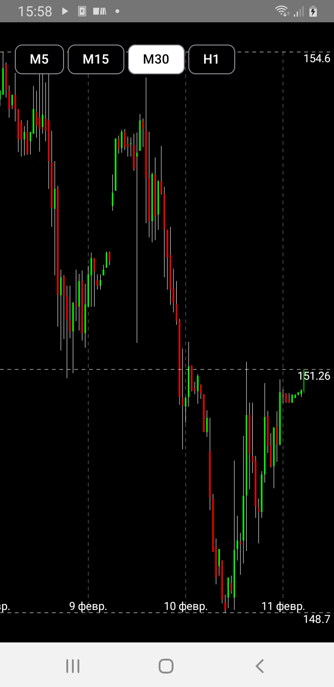

# Terminal
Учебное приложение (изучение Jetpack Compose)

Android-приложение, которое из себя представляет график цены акций, полученные из интернета. У него всего лишь один экран, но в нём мы можем скроллить, машстабировать и менять таймфреймы.

Целью было изучение Custom View (Canvas) в Jetpack Compose и сопутствующие классы, функции для достижения нужных поведений.

Внешность
-

